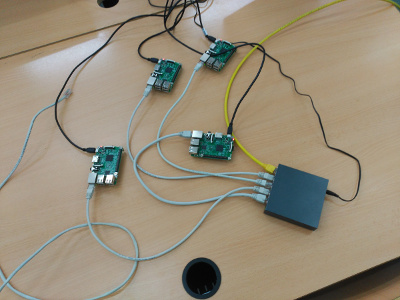

## Introducción

El objetivo de este proyecto es la creación de un cluster con dispositivos Raspberry Pi para realizar la instalación y configuración de distintos software que nos permita la creación de un cluster de contenedores docker, y en nuestro caso vamos a probar Docker Swarm y Kubernetes.

Otros objetivos alcanzados con este proyectos son:

* El aprendizaje obtenido al trabajar con hardware y software de otra arquitectura (arm).
* 

